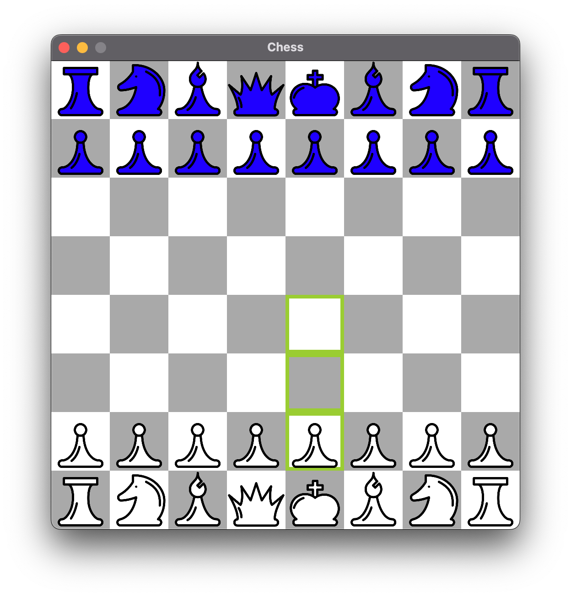
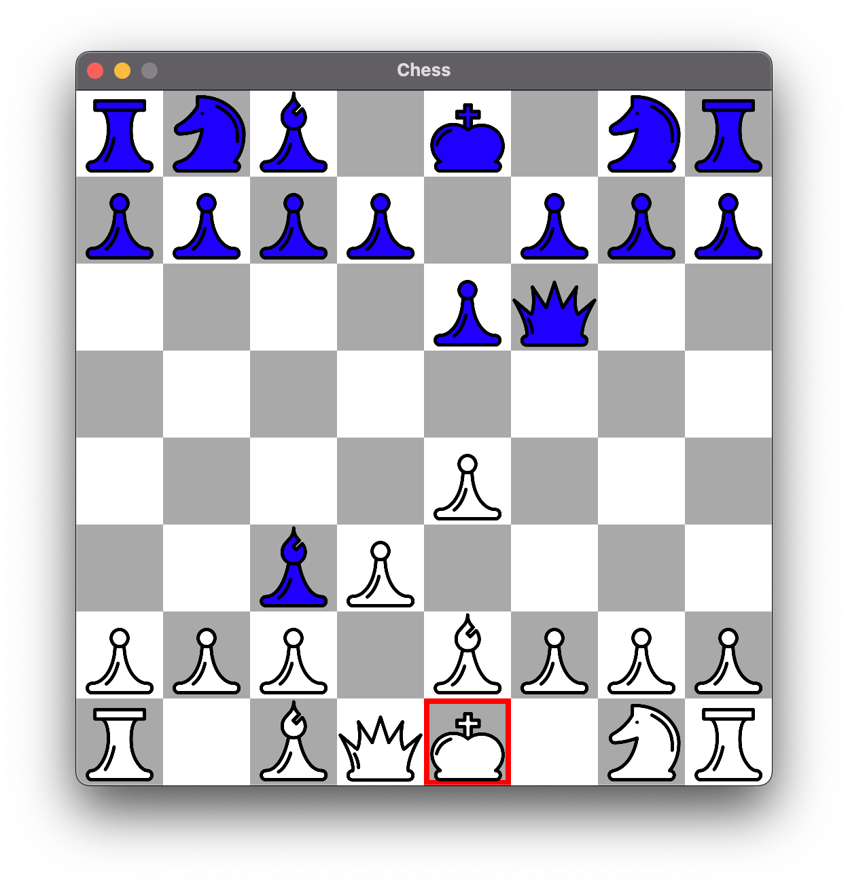

# Simple Chess Engine

A simple chess engine and UI using JavaFX and the Minimax Algorithm with Alpha-Beta pruning. (Created in June 2018, the summer between graduating high school and starting college)





## Building

To generate a jar with JavaFX built in run

```bash
mvn clean compile assembly:single
```
Then launch the application with

```bash
java -jar target/Simple-Chess-Engine-1.0.0-jar-with-dependencies.jar
```

Note: the application expects a `Chess/` folder to be in your current directly. This folder holds the resources for the pieces and different AI configurations. For this reason the `java` command must be run from the root of the project as shown.
